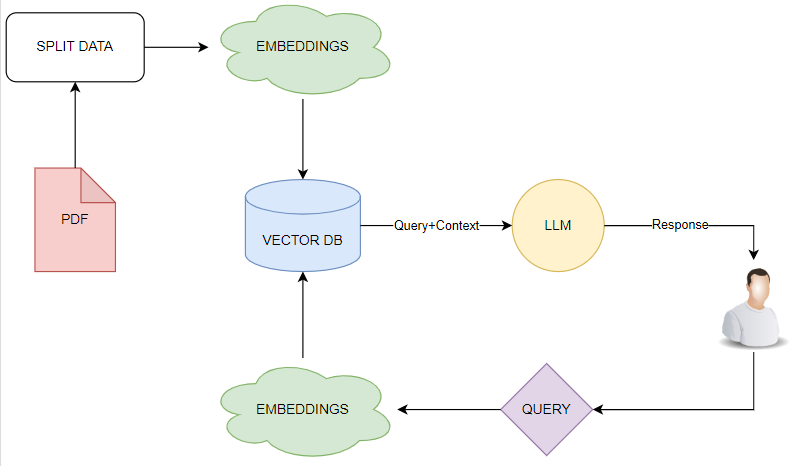
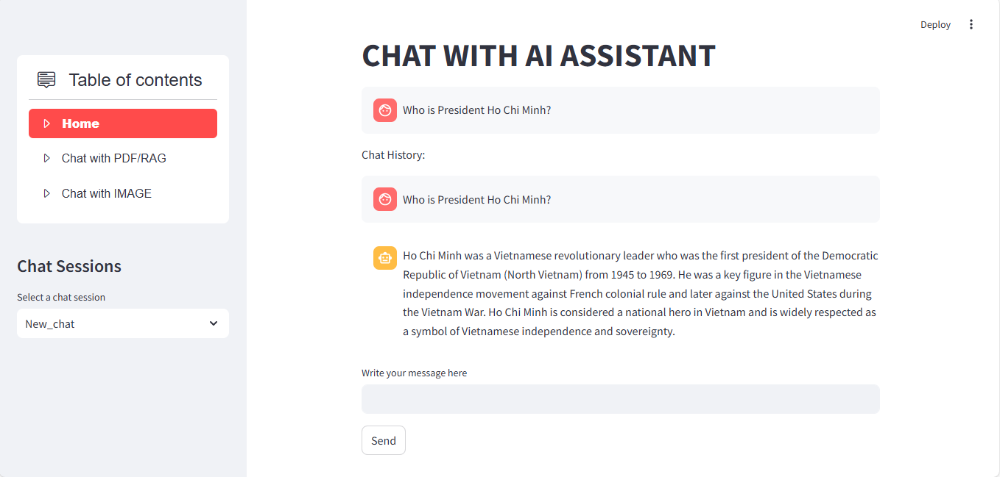
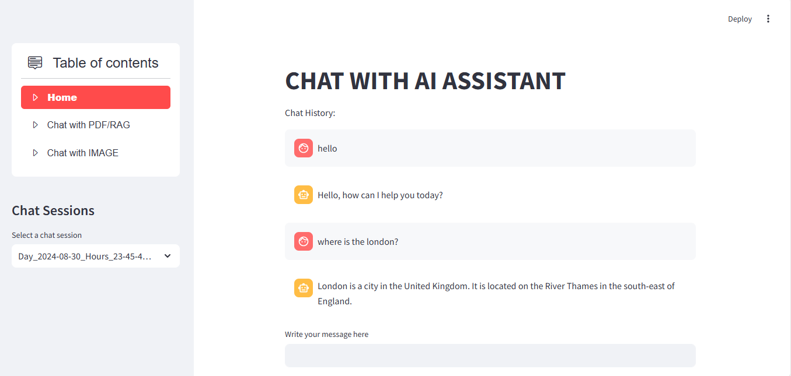
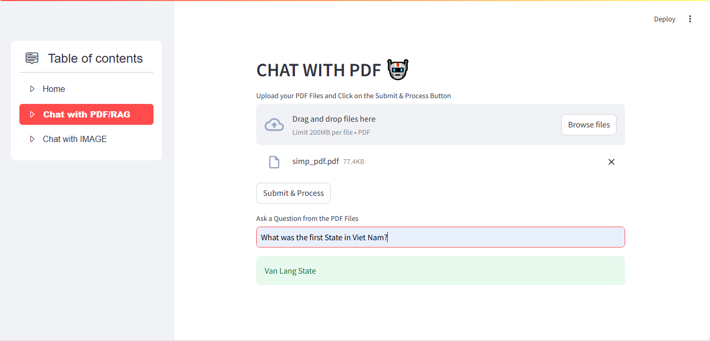
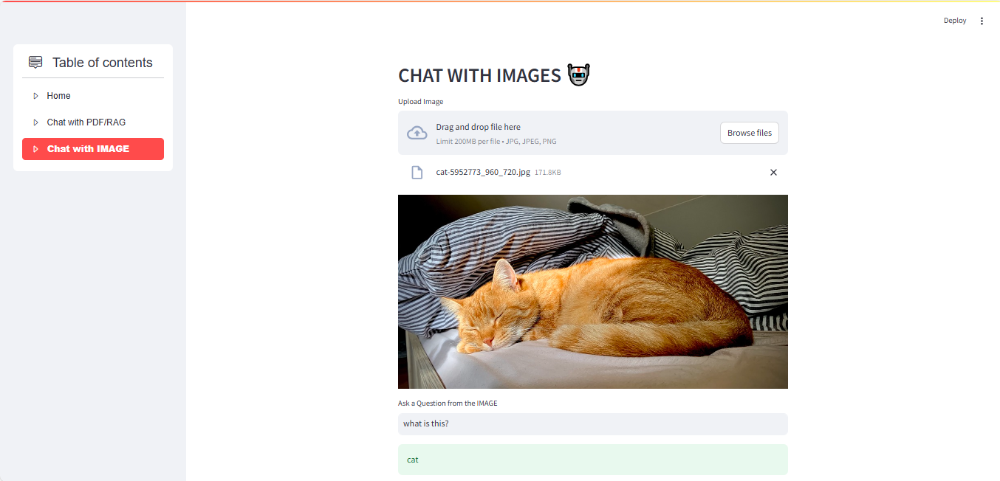

# Streamlit AI Chat Assistant

This application is a versatile AI-powered assistant built with Streamlit that allows users to interact with an AI chatbot, ask questions from uploaded PDF documents, and perform image processing tasks. It leverages advanced models for Natural Language Processing (NLP) and utilizes Google Generative AI for embeddings and conversational responses.

## Table of Contents

- [Streamlit AI Chat Assistant](#streamlit-ai-chat-assistant)
  - [Table of Contents](#table-of-contents)
  - [Introduction](#introduction)
  - [Features](#features)
  - [Installation](#installation)
  - [Usage](#usage)
  - [How to Use the Models](#how-to-use-the-models)
  - [Run the project](#run-the-project)
  - [Configuration](#configuration)
  - [Technical Overview](#technical-overview)
  - [Contact](#contact)


## Introduction

 * The RAG Chatbot operates by ingesting a collection of PDF files and, upon receiving a question, delivers an answer derived from the context within those files.

   

   The Memory Builder component processes PDFs from the uploaded files, breaking them into manageable sections and calculating their embeddings using Google Generative AI models. These embeddings are then stored in a FAISS vector database. When a user poses a question, the RAG ChatBot retrieves relevant sections from the embedding database and generates a final answer using a local LLM. Additionally, the chatbot remembers past interactions by leveraging chat history and context from previous conversations to improve its responses over time.

* The Chat with Image feature operates by analyzing uploaded images and responding to user questions based on the content within those images.
The image processing component works by accepting user-uploaded images, which are then analyzed using advanced visual-question-answering (VQA) models like BLIP-VQA. This model processes the images and extracts relevant features, enabling the system to understand the visual context.

## Features
* **Chat with AI**: Engage in a conversation with an AI assistant that remembers past sessions and provides contextual responses.
* **Chat with PDF/RAG**: Upload PDF documents and ask questions directly related to the content, leveraging Google Generative AI for retrieving and answering based on document content.
* **Chat with IMAGE**: Upload images and ask questions about them using the BLIP (Bootstrapping Language-Image Pre-training) model.

## Installation
To run this application, you need to have Python installed. Follow the steps below to set up and run the application:
1. **Clone the repository:**: 
   ```sh
   git clone https://github.com/HaiYen3012/CHATBOT-WEB.git
   cd CHATBOT-WEB
   ```
2. **Create a virtual environment (optional but recommended):**: 
   ```sh
   python -m venv venv
   source venv/bin/activate  # On Windows use: venv\Scripts\activate
   ```
3. **Install the required packages:**: 
   ```sh
   pip install -r requirements.txt
   ```
4. **Enter commands in terminal to interact with a GUI**:
   ```sh
   streamlit run .\Streamlit_RAG.py
   ```

## Usage
1. **Home**
   * Interact with the AI assistant in a chat format.
   * View and manage chat sessions.
   * Save chat histories to review later.
2. **Chat with PDF/RAG**
   * Upload one or multiple PDF documents.
   * Extract and split text from PDFs.
   * Create a vector store using Google Generative AI embeddings.
   * Ask questions based on the uploaded PDF content.
3. **Chat with IMAGE**
   * Upload a image.
   * Ask questions based on the uploaded Imgae content.

## How to Use the Models
1. **Access the HuggingFace Models Page**: Visit https://huggingface.co/models to view the list of available models.
2. **Choose a Suitable Model**: You can use the search bar to find [models](https://huggingface.co/docs/transformers/v4.29.1/en/model_doc/blip).
3. **Download Instructions**: On the selected model's page, you will find detailed instructions on how to download and use the model with the HuggingFace Transformers library. For example:
   ```sh
   from transformers import BlipProcessor, BlipForQuestionAnswering
   model = BlipForQuestionAnswering.from_pretrained("Salesforce/blip-vqa-base")
   processor = BlipProcessor.from_pretrained("Salesforce/blip-vqa-base")
   ```
4. **Customize and Run the Model**: Follow the instructions to configure and integrate the model into your code according to your application's needs.
   
## Run the project
* Chatbot activities:

  
* Chat session history 2024/08/30 at 23:45:

  
* Chatbot RAG's behavior when uploading a PDF file:

  
  Here is a piece of content containing the answer to the question "What was the first State in Vietnam" in the uploaded PDF file:
  
  
* Chat with Image:

  

## Configuration
Ensure the Google API key is properly set up in the code for [Google Generative AI integrations](https://makersuite.google.com/app/apikey).
```sh
GOOGLE_API_KEY = 'GOOGLE_API_KEY'
```
## Technical Overview
* **Streamlit**: Web application framework for interactive UI.
* **PyPDF2**: Extract text from PDFs for question answering.
* **FAISS**: Vector database for efficient similarity searches.
* **Google Generative AI**: Provides embeddings and chat functionalities.
* **BLIP (Salesforce/blip-vqa-base)**: Vision-Language model for image question answering.
* **Python**: Main programming language for backend processing.
  
## Contact
<div align="center">
  <a href="https://www.facebook.com/profile.php?id=100039096104296">
  
  </a>
  <a href="https://www.linkedin.com/in/y%E1%BA%BFn-l%C3%AA-h%E1%BA%A3i-5625662ab/">
    
  </a>
  <a href="https://github.com/HaiYen3012">
    
  </a>
</div>